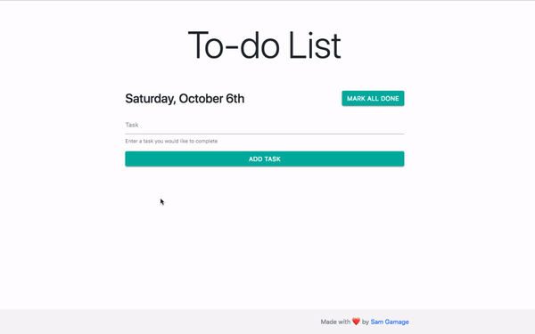

# README

# Ruby
Uses ruby version 2.4.1 (Updated 10/18)

# Rails
Uses rails version 5.1.4 (Updated 10/18)

# What to expect
In this project you will find a picture posting application made to look like pintrest.

# What can I contribute?
Contact me if you are serious about contributing to this project. Minimal design changes are accepted anonymously and changes that make the application run faster.

# Database
This application uses PostgreSQL as its database.

# Added gems
Added gems include bootstrap 4 (alpha 3 build), friendlyid, jquery, etc.

# To run this project
Download and install the latest versions of Ruby and Ruby on rails, then navigate to the main directory via command prompt or command line, then use the rails server command to start the server. Finally, navigate to localhost:3000 in your browser.

# Preview

